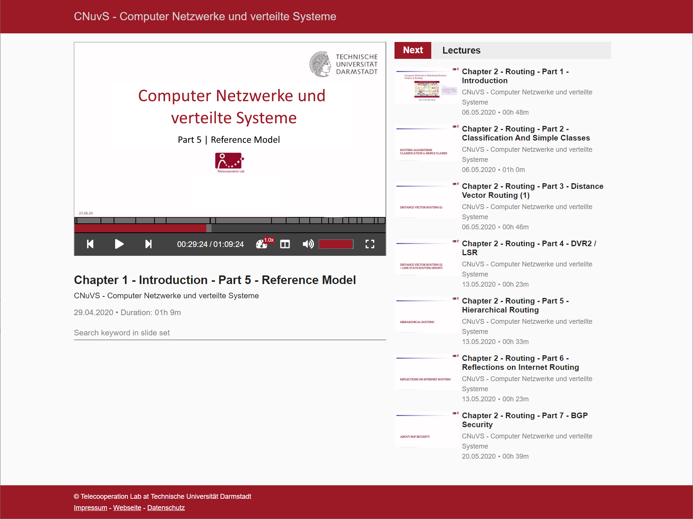

# LecturePlayer

This project contains the web interface for the lecture recording system of the Telecooperation lab at Technische Universität Darmstadt. It allows browsing through the recorded courses and lectures.

This project was generated with Angular CLI.

## Features

- Multi-course support (i.e., multiple courses can be organized within a single web app)
- List of lecture recordings
- Uses multi-stream video player from HPI for separate presenter and slide view (adjustable)
- Support for slide thumbnails
- Support for slideset search within a single lecture (jump to position)
- Supports a wide range of devices (responsive design)

## Development

### Download all dependencies

Run `npm install` to download all dependencies for the project.

### Development server

Run `ng serve` for a dev server. Navigate to `http://localhost:4200/`. The app will automatically reload if you change any of the source files.

### Code scaffolding

Run `ng generate component component-name` to generate a new component. You can also use `ng generate directive|pipe|service|class|guard|interface|enum|module`.

### Build

Run `ng build` to build the project. The build artifacts will be stored in the `dist/` directory. Use the `-prod` flag for a production build.